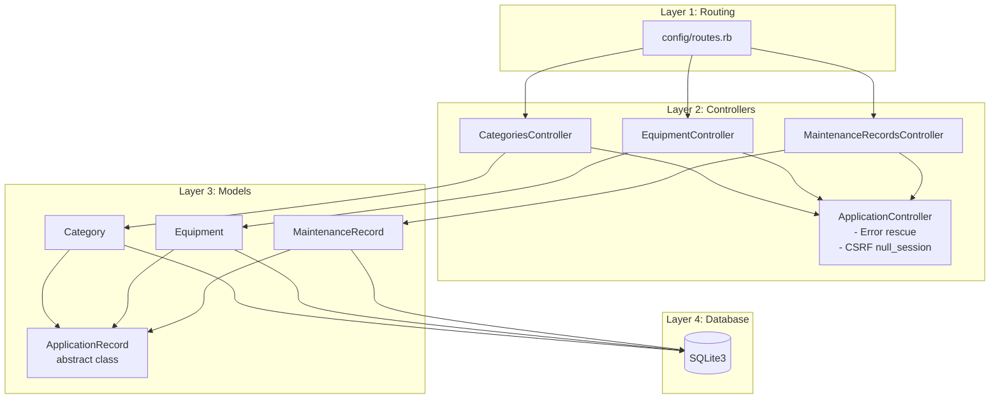
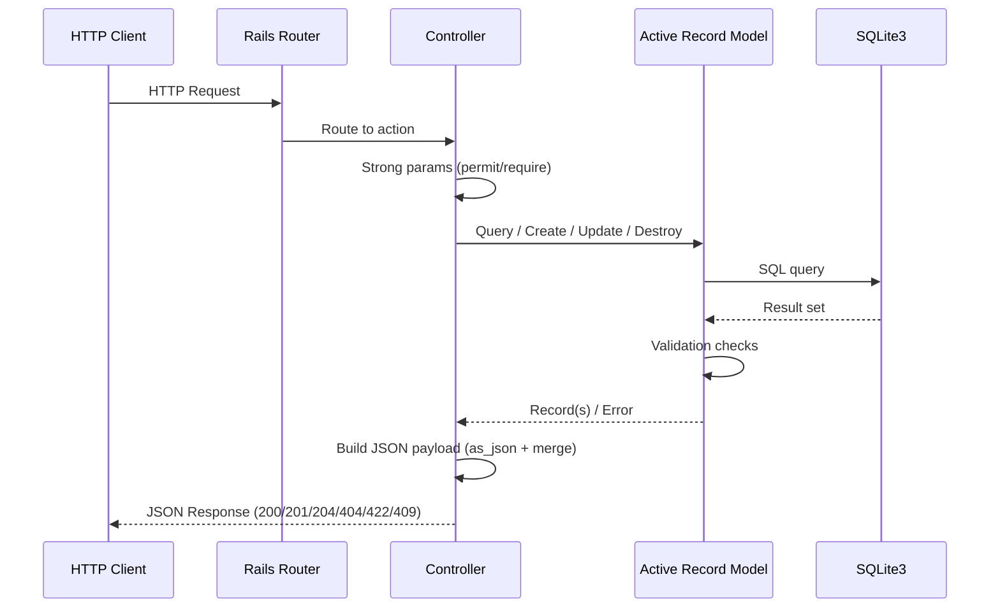
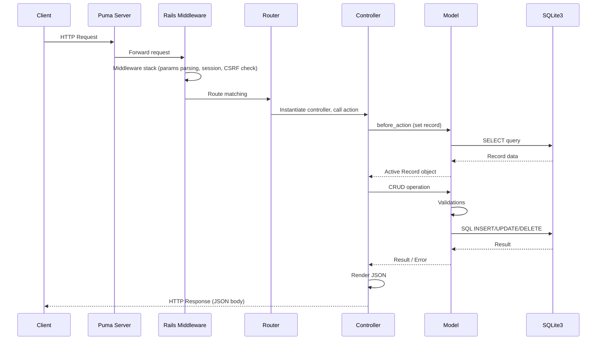
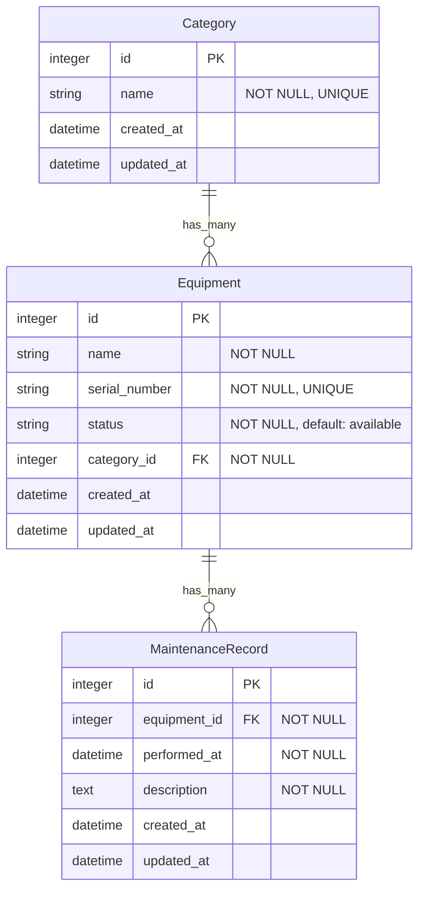
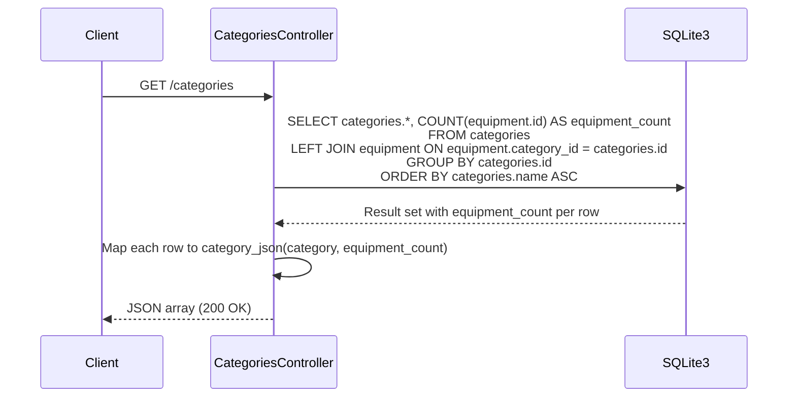
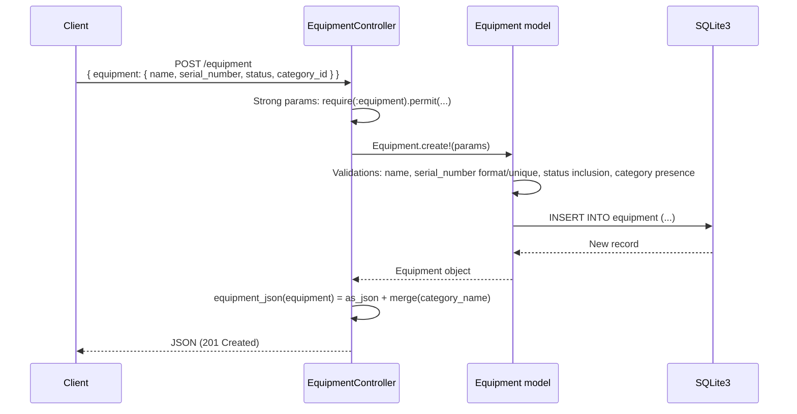
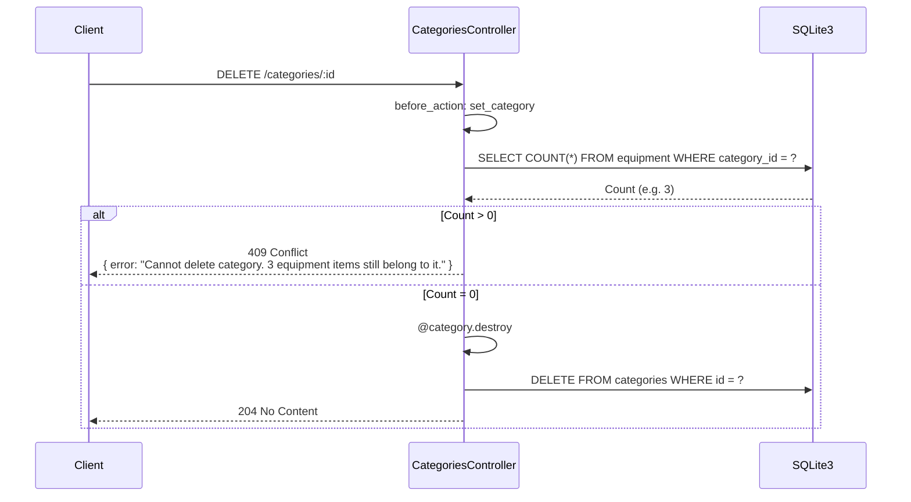
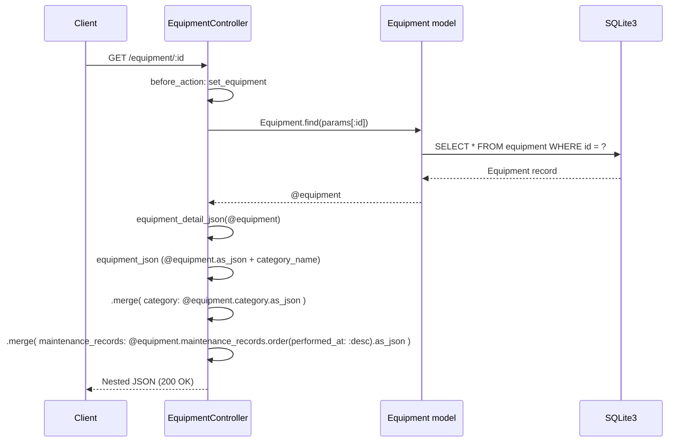
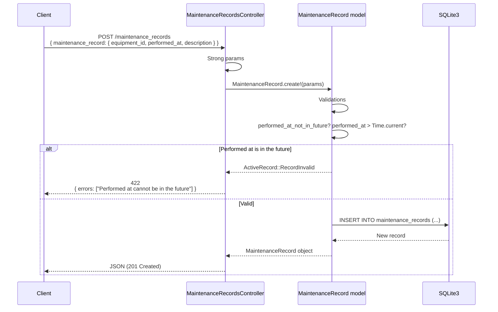
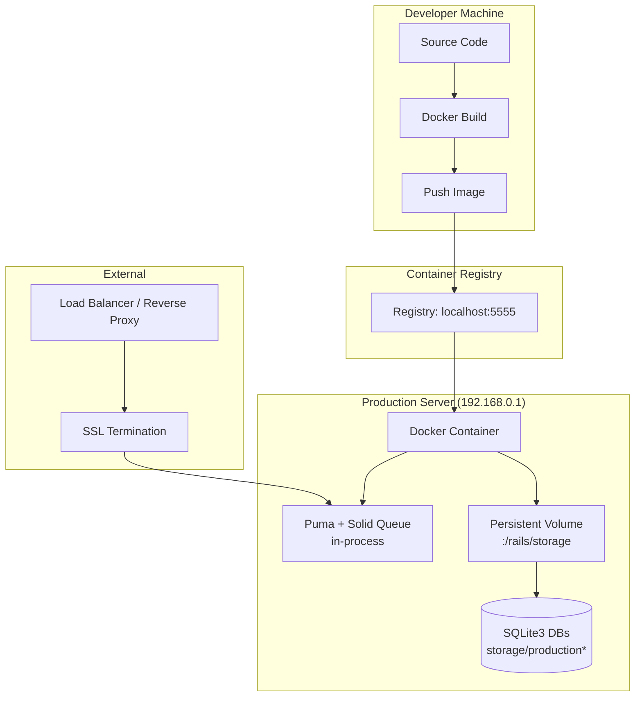

# Technical Documentation — Lab Resource Management API

## Table of Contents

1. [System Overview](#1-system-overview)
2. [Technology Stack](#2-technology-stack)
3. [Project Structure](#3-project-structure)
4. [Languages and Frameworks](#4-languages-and-frameworks)
5. [Architecture](#5-architecture)
6. [Data Models](#6-data-models)
7. [API Contracts](#7-api-contracts)
8. [Request/Response Lifecycle](#8-requestresponse-lifecycle)
9. [Error Handling Strategy](#9-error-handling-strategy)
10. [Business Flows](#10-business-flows)
11. [Development Workflows](#11-development-workflows)
12. [Deployment Architecture](#12-deployment-architecture)
13. [Environment Configuration](#13-environment-configuration)
14. [Background Jobs and Scheduled Tasks](#14-background-jobs-and-scheduled-tasks)
15. [Testing Strategy](#15-testing-strategy)
16. [Security and Logging](#16-security-and-logging)

---

## 1. System Overview

**Lab Resource Management** is a RESTful JSON API built with **Ruby on Rails 8.1** that tracks laboratory resources, equipment statuses, and historical maintenance logs. It provides a centralized system for managing:

- **Categories** of lab equipment (e.g., Computing, Optics, Networking, Electronics)
- **Equipment** items with serial numbers, status flags, and category assignments
- **Maintenance Records** with timestamps and descriptions for each piece of equipment

The application is a **pure JSON API** — no server-rendered HTML for the main resources. CSRF protection is disabled to support external JSON clients (e.g., curl, frontend apps, scripts).

### Key Design Decisions

| Decision | Rationale |
|----------|-----------|
| SQLite3 database | Simple single-server deployment; no external DB server needed |
| JSON-only API | CSRF disabled via `:null_session` for easy consumption by any client |
| Global error rescue | Consistent JSON error responses for 404 and 422 across all endpoints |
| No authentication | The app has no user/auth system (no `has_secure_password`, no Devise, no JWT) |
| Solid Queue + Solid Cache | Database-backed job queue and cache; no Redis dependency |
| Kamal deployment | Docker-based single-server deployment strategy |

---

## 2. Technology Stack

### Backend

| Technology | Version | Purpose |
|------------|---------|---------|
| Ruby | `3.4.9` (see `.ruby-version`) | Application language |
| Ruby on Rails | `~> 8.1.3` | Web framework |
| SQLite3 | `>= 2.1` | Database |
| Puma | `>= 5.0` | HTTP server |
| Propshaft | — | Asset pipeline (modern replacement for Sprockets) |
| JBuilder | — | JSON template building (scaffold default, not used by controllers) |

### Database-Backed Services (Solid Gems)

| Gem | Purpose | Production DB |
|-----|---------|---------------|
| `solid_cache` | Rails cache store | `storage/production_cache.sqlite3` |
| `solid_queue` | Active Job backend | `storage/production_queue.sqlite3` |
| `solid_cable` | Action Cable adapter | `storage/production_cable.sqlite3` |

### Frontend / JavaScript

| Technology | Purpose |
|------------|---------|
| Importmap-Rails | JavaScript dependency management (no bundler) |
| Turbo | Hotwire page navigation |
| Stimulus | Hotwire JavaScript framework |
| Turbo & Stimulus | Used by standard Rails scaffold, but the JSON controllers do not rely on them |

### Infrastructure

| Tool | Purpose |
|------|---------|
| Docker | Container runtime |
| Kamal | Deployment tool (Docker-based, no Kubernetes) |
| Thruster | Production HTTP caching/compression, X-Sendfile acceleration |

### CI / Quality

| Tool | Purpose |
|------|---------|
| RuboCop (Omakase) | Ruby code style enforcement (`bin/rubocop`) |
| Bundler-audit | Gem vulnerability auditing |
| Brakeman | Static security analysis |
| Dependabot | Weekly dependency update PRs (configured in `.github/dependabot.yml`) |
| GitHub Actions | CI pipeline (`.github/workflows/ci.yml`) |

### Testing

| Tool | Version/Scope |
|------|--------------|
| Rails Minitest (ActiveSupport::TestCase) | Unit + integration tests |
| Capybara | System tests (declared in Gemfile, not yet used) |
| Selenium WebDriver | Browser driver for system tests |
| Fixtures (YAML) | Test data in `test/fixtures/` |

---

## 3. Project Structure

```
Lab_resource_management/
├── .github/                          # GitHub configuration
│   ├── dependabot.yml                # Weekly dependency update schedule
│   └── workflows/ci.yml             # CI pipeline definition
├── .kamal/                           # Kamal deployment secrets
├── .rubocop.yml                      # RuboCop style config (Omakase)
├── .ruby-version                     # Ruby version pin: 3.4.9
├── Dockerfile                        # Production Docker image (multi-stage)
├── Gemfile                           # Ruby dependency manifest
├── Gemfile.lock                      # Locked dependency versions
├── Rakefile                          # Rake task definitions
├── README.md                         # Project README
├── config.ru                         # Rack configuration
├── technicalDocumentation.md         # THIS FILE
├── app/
│   ├── assets/
│   │   └── stylesheets/application.css  # Global stylesheet
│   ├── controllers/                  # Request handlers
│   │   ├── application_controller.rb # Base controller (error rescue, CSRF)
│   │   ├── categories_controller.rb  # CRUD for categories
│   │   ├── equipment_controller.rb   # CRUD for equipment
│   │   └── maintenance_records_controller.rb  # CRUD for maintenance records
│   ├── helpers/                      # View helper modules (empty)
│   │   ├── application_helper.rb
│   │   └── maintenance_records_helper.rb
│   ├── javascript/                   # JS via importmaps
│   │   ├── application.js            # Entry point (Turbo + Stimulus)
│   │   └── controllers/              # Stimulus controllers
│   │       ├── application.js        # Stimulus app init
│   │       ├── hello_controller.js   # Example controller
│   │       └── index.js              # Eager-loads all controllers
│   ├── jobs/                         # Active Job base class
│   │   └── application_job.rb        # Base job (no custom jobs yet)
│   ├── mailers/                      # Action Mailer base class
│   │   └── application_mailer.rb     # Default from/layout (no custom mailers)
│   ├── models/                       # Active Record models
│   │   ├── application_record.rb     # Base model (abstract class)
│   │   ├── category.rb               # Category entity
│   │   ├── equipment.rb              # Equipment entity
│   │   └── maintenance_record.rb     # MaintenanceRecord entity
│   └── views/                        # View templates
│       ├── layouts/                  # App + mailer layouts
│       │   ├── application.html.erb  # Main HTML layout (PWA, Turbo, Stimulus)
│       │   ├── mailer.html.erb
│       │   └── mailer.text.erb
│       ├── maintenance_records/      # Scaffold views (NOT used — controller renders JSON)
│       │   ├── index.html.erb
│       │   ├── show.html.erb
│       │   ├── create.html.erb
│       │   ├── update.html.erb
│       │   └── destroy.html.erb
│       └── pwa/                      # Progressive Web App support
│           ├── manifest.json.erb
│           └── service-worker.js
├── bin/                              # Rails binstubs
│   ├── rails, rake, setup, dev, docker-entrypoint, etc.
├── config/                           # Application configuration
│   ├── application.rb                # Rails app config (Rails 8.1 defaults)
│   ├── boot.rb                       # Bundler + Bootsnap setup
│   ├── cable.yml                     # Action Cable config (async dev, solid_cable prod)
│   ├── cache.yml                     # Solid Cache config (256 MB max, env namespace)
│   ├── ci.rb                         # CI pipeline DSL (used by bin/ci)
│   ├── database.yml                  # SQLite3 database config
│   ├── deploy.yml                    # Kamal deployment config
│   ├── environment.rb                # Rails initialization
│   ├── environments/
│   │   ├── development.rb            # Dev: reloading, verbose logs, memory cache
│   │   ├── test.rb                   # Test: null cache, eager load on CI
│   │   └── production.rb             # Prod: solid_cache, solid_queue, stdout logging
│   ├── importmap.rb                  # JS import map pins
│   ├── initializers/
│   │   ├── assets.rb                 # Asset version "1.0"
│   │   ├── content_security_policy.rb  # CSP (commented out)
│   │   ├── filter_parameter_logging.rb # Sensitive params filter
│   │   └── inflections.rb            # Inflection rules (none active)
│   ├── puma.rb                       # Puma: 3 threads, port 3000, solid_queue plugin
│   ├── queue.yml                     # Solid Queue: 1 dispatcher, 3 threads, * queues
│   ├── recurring.yml                 # Scheduled SolidQueue cleanup (prod only)
│   ├── routes.rb                     # 3 API resources + health check
│   └── storage.yml                   # Active Storage: local disk (test + dev), no cloud
├── db/
│   ├── cable_schema.rb               # Solid Cable schema (auto-generated)
│   ├── cache_schema.rb               # Solid Cache schema (auto-generated)
│   ├── queue_schema.rb               # Solid Queue schema (auto-generated)
│   ├── schema.rb                     # Main application schema
│   ├── seeds.rb                      # Seed data: 4 categories, 9 equipment, 5 records
│   └── migrate/
│       ├── 20260528175539_create_categories.rb
│       ├── 20260528175707_create_equipment.rb
│       └── 20260528175719_create_maintenance_records.rb
├── lib/
│   └── tasks/                        # Rake tasks (empty)
├── log/                              # Log files (gitignored)
├── public/                           # Static assets / error pages
├── storage/                          # SQLite DBs + Active Storage (gitignored)
├── test/
│   ├── test_helper.rb                # Base test config (fixtures, parallelize)
│   ├── controllers/
│   │   ├── categories_controller_test.rb        # 8 tests
│   │   ├── equipment_controller_test.rb         # 11 tests
│   │   └── maintenance_records_controller_test.rb # 9 tests
│   ├── models/
│   │   ├── category_test.rb                     # 7 tests
│   │   ├── equipment_test.rb                    # 10 tests
│   │   └── maintenance_record_test.rb           # 7 tests
│   └── fixtures/
│       ├── categories.yml            # 2 fixtures: Electronics, Furniture
│       ├── equipment.yml             # 2 fixtures: Laptop (available), Desk (in_use)
│       └── maintenance_records.yml   # 2 fixtures
└── vendor/                           # Vendored JavaScript
```

---

## 4. Languages and Frameworks

### Ruby (`.rb` files)

| Location | Purpose |
|----------|---------|
| `app/models/*.rb` | Active Record models with validations and associations |
| `app/controllers/*.rb` | Request handling, JSON rendering, error responses |
| `app/jobs/application_job.rb` | Base class for background jobs |
| `app/mailers/application_mailer.rb` | Base class for mailers |
| `app/helpers/*.rb` | View helpers (currently empty modules) |
| `config/*.rb` | Rails configuration, environments, initializers |
| `config/routes.rb` | URL routing |
| `config/ci.rb` | CI pipeline DSL |
| `db/seeds.rb` | Database seed data |
| `db/migrate/*.rb` | Database schema migrations |
| `test/**/*.rb` | Test suite |
| `lib/tasks/*.rake` | Custom Rake tasks (none defined) |
| `Gemfile` | Ruby dependency manifest |

**Key Ruby frameworks/libraries:** Rails 8.1, Active Record, Action Pack, Active Job, Action Mailer, Action Cable, Active Storage, Puma, Solid Queue, Solid Cache, Solid Cable.

### JavaScript (`.js` files)

| Location | Purpose |
|----------|---------|
| `app/javascript/application.js` | Entry point, imports Turbo + Stimulus |
| `app/javascript/controllers/*.js` | Stimulus controllers (only hello_controller.js) |

**Frameworks:** Hotwire (Turbo + Stimulus), loaded via Importmap.

### SQL (embedded in Ruby)

- **Active Record migrations** — DDL for `categories`, `equipment`, `maintenance_records` tables
- **Active Record queries** — Scattered across controllers (`.left_joins`, `.includes`, `.where`, `.order`, `.group`, `.count`)
- **SQLite3** — The underlying database engine

### Shell / Script

| File | Purpose |
|------|---------|
| `bin/` | Rails binstubs (rails, rake, setup, dev, docker-entrypoint) |
| `Dockerfile` | Multi-stage container image build |
| `.rubocop.yml` | RuboCop configuration |
| `config/deploy.yml` | Kamal deployment DSL (Ruby-like YAML) |

### YAML / Config Languages

| File | Purpose |
|------|---------|
| `config/database.yml` | Database connection configuration |
| `config/cable.yml` | Action Cable adapter configuration |
| `config/cache.yml` | Solid Cache store configuration |
| `config/queue.yml` | Solid Queue dispatcher/worker configuration |
| `config/deploy.yml` | Kamal deployment infrastructure definition |
| `config/storage.yml` | Active Storage service definitions |
| `.github/dependabot.yml` | Dependabot schedule configuration |
| `.ruby-version` | Ruby version pin |

---

## 5. Architecture

### High-Level Overview

```mermaid
graph TB
    subgraph Clients
        A[curl / HTTP Client]
        B[Frontend App]
    end

    subgraph Rails Application
        C[Puma Web Server<br/>port 3000]
        D[Solid Queue Supervisor<br/>(in-process, prod only)]
        E[Action Cable<br/>(solid_cable prod)]
        F[Solid Cache<br/>(memory dev / solid_cache prod)]
    end

    subgraph Database
        G[(SQLite3<br/>storage/development.sqlite3)]
        H[(SQLite3<br/>storage/test.sqlite3)]
        I[(SQLite3<br/>storage/production.sqlite3)]
        J[(SQLite3<br/>storage/production_cache.sqlite3)]
        K[(SQLite3<br/>storage/production_queue.sqlite3)]
        L[(SQLite3<br/>storage/production_cable.sqlite3)]
    end

    A -->|HTTP| C
    B -->|HTTP| C
    C --> G
    C --> F
    C --> E
    D --> K
    E --> L
    F --> J
```

### Application Layers



### Layer Responsibilities

| Layer | Responsibility |
|-------|---------------|
| **Routes** (`config/routes.rb`) | Map HTTP verbs + paths to controller actions |
| **ApplicationController** | Base error handling (`ActiveRecord::RecordNotFound` → 404, `ActiveRecord::RecordInvalid` → 422); CSRF disabled |
| **Resource Controllers** | Accept params, validate via strong params, call model CRUD, render JSON responses |
| **Models** | Business logic (validations, associations, custom validations), database access via Active Record |
| **Database** | SQLite3 relational storage with foreign keys and unique constraints |

### Data Flow Between Components



### Request/Response Lifecycle



---

## 6. Data Models

### Entity-Relationship Diagram



### Table: `categories`

| Column | Type | Constraints |
|--------|------|-------------|
| `id` | `INTEGER` | Primary key, auto-increment |
| `name` | `STRING` | `NOT NULL`, `UNIQUE` (indexed) |
| `created_at` | `DATETIME` | `NOT NULL` |
| `updated_at` | `DATETIME` | `NOT NULL` |

**Indexes:** `index_categories_on_name` (unique)

**Corresponding Model** — `app/models/category.rb`

| Aspect | Details |
|--------|---------|
| Associations | `has_many :equipment, dependent: :restrict_with_error` |
| Validations | `name`: presence, uniqueness, minimum length 3 |
| Key behavior | Cannot be deleted if equipment records reference it (409 Conflict) |

### Table: `equipment`

| Column | Type | Constraints |
|--------|------|-------------|
| `id` | `INTEGER` | Primary key, auto-increment |
| `name` | `STRING` | `NOT NULL` |
| `serial_number` | `STRING` | `NOT NULL`, `UNIQUE` (indexed) |
| `status` | `STRING` | `NOT NULL`, default `'available'` |
| `category_id` | `INTEGER` | `NOT NULL`, Foreign Key → `categories(id)` |
| `created_at` | `DATETIME` | `NOT NULL` |
| `updated_at` | `DATETIME` | `NOT NULL` |

**Indexes:** `index_equipment_on_category_id`, `index_equipment_on_serial_number` (unique)

**Foreign Key:** `fk_rails_...` — `equipment.category_id` → `categories.id`

**Corresponding Model** — `app/models/equipment.rb`

| Aspect | Details |
|--------|---------|
| Associations | `belongs_to :category`, `has_many :maintenance_records, dependent: :destroy` |
| Validations | `name`: presence, min 3 chars, must contain at least one letter |
| | `serial_number`: presence, uniqueness, format `XXX-NNN` (3 uppercase letters, dash, 3 digits) |
| | `status`: presence, inclusion in `[available, in_use, maintenance]` |
| Key behavior | Deleting equipment cascades to its maintenance records |

### Table: `maintenance_records`

| Column | Type | Constraints |
|--------|------|-------------|
| `id` | `INTEGER` | Primary key, auto-increment |
| `equipment_id` | `INTEGER` | `NOT NULL`, Foreign Key → `equipment(id)` |
| `performed_at` | `DATETIME` | `NOT NULL` |
| `description` | `TEXT` | `NOT NULL` |
| `created_at` | `DATETIME` | `NOT NULL` |
| `updated_at` | `DATETIME` | `NOT NULL` |

**Indexes:** `index_maintenance_records_on_equipment_id`, `index_maintenance_records_on_equipment_id_and_performed_at` (composite)

**Foreign Key:** `fk_rails_...` — `maintenance_records.equipment_id` → `equipment.id`

**Corresponding Model** — `app/models/maintenance_record.rb`

| Aspect | Details |
|--------|---------|
| Associations | `belongs_to :equipment` |
| Validations | `performed_at`: presence |
| | `description`: presence |
| | Custom: `performed_at_not_in_future` (`performed_at` cannot be after `Time.current`) |
| Key behavior | `belongs_to :equipment` is required by default (no separate presence validation needed) |

### Validation Rules Summary

| Model | Field | Rules |
|-------|-------|-------|
| Category | `name` | Required, unique, min 3 characters |
| Equipment | `name` | Required, min 3 characters, must contain at least one letter |
| Equipment | `serial_number` | Required, unique, format `XXX-NNN` |
| Equipment | `status` | Required, must be `available`, `in_use`, or `maintenance` |
| Equipment | `category` | Required (belongs_to) |
| MaintenanceRecord | `equipment` | Required (belongs_to) |
| MaintenanceRecord | `performed_at` | Required, cannot be in the future |
| MaintenanceRecord | `description` | Required |

---

## 7. API Contracts

### Base URL

Development: `http://localhost:3000`

### Common Response Format

```json
// Success (200 / 201)
{ "id": 1, "name": "...", ... }

// 404 Not Found
{ "error": "Category not found" }

// 422 Unprocessable Entity
{ "errors": ["Name can't be blank", "Name is too short (minimum is 3 characters)"] }

// 409 Conflict (category deletion only)
{ "error": "Cannot delete category. 3 equipment items still belong to it." }

// 204 No Content (successful deletion — empty body)
```

### Categories

---

#### `GET /categories`

List all categories ordered alphabetically by name, with equipment count.

**Response `200 OK`**

```json
[
  {
    "id": 1,
    "name": "Computing",
    "created_at": "2026-05-28T17:57:19.000Z",
    "updated_at": "2026-05-28T17:57:19.000Z",
    "equipment_count": 2
  },
  {
    "id": 2,
    "name": "Electronics",
    "created_at": "2026-05-28T17:57:19.000Z",
    "updated_at": "2026-05-28T17:57:19.000Z",
    "equipment_count": 3
  }
]
```

**Implementation** (`app/controllers/categories_controller.rb:6-12`): Uses `left_joins(:equipment)` + `GROUP BY` + `COUNT` to compute equipment_count in a single query (avoids N+1).

---

#### `GET /categories/:id`

Show a single category with its equipment count.

**Parameters:** `id` (path, integer)

**Response `200 OK`**

```json
{
  "id": 1,
  "name": "Computing",
  "created_at": "...",
  "updated_at": "...",
  "equipment_count": 2
}
```

**Response `404 Not Found`**

```json
{ "error": "Category not found" }
```

---

#### `POST /categories`

Create a new category.

**Request Body** (`application/json` or form-encoded)

```json
{ "category": { "name": "Robotics" } }
```

**Validation Rules for `name`:**
- Required
- Unique (case-sensitive in SQLite)
- Minimum 3 characters

**Response `201 Created`**

```json
{
  "id": 3,
  "name": "Robotics",
  "created_at": "...",
  "updated_at": "...",
  "equipment_count": 0
}
```

**Response `422 Unprocessable Entity`**

```json
{ "errors": ["Name has already been taken"] }
```

---

#### `PATCH /categories/:id`

Update an existing category.

**Parameters:** `id` (path, integer)

**Request Body**

```json
{ "category": { "name": "Updated Name" } }
```

**Response `200 OK`**

```json
{
  "id": 1,
  "name": "Updated Name",
  "created_at": "...",
  "updated_at": "...",
  "equipment_count": 2
}
```

**Response `404` / `422`** — Same format as other endpoints.

---

#### `DELETE /categories/:id`

Delete a category.

**Parameters:** `id` (path, integer)

**Response `204 No Content`** — When no equipment references the category.

**Response `409 Conflict`** — When equipment still references the category.

```json
{ "error": "Cannot delete category. 2 equipment items still belong to it." }
```

**Response `404 Not Found`** — If category does not exist.

---

### Equipment

---

#### `GET /equipment`

List all equipment ordered by name, with optional `?status=` filter.

**Query Parameters:**

| Parameter | Type | Required | Description |
|-----------|------|----------|-------------|
| `status` | string | No | Filter by status (`available`, `in_use`, `maintenance`) |

**Response `200 OK`**

```json
[
  {
    "id": 1,
    "name": "Dell Latitude 5520",
    "serial_number": "DLL-001",
    "status": "available",
    "category_id": 1,
    "created_at": "...",
    "updated_at": "...",
    "category_name": "Computing"
  }
]
```

Each item includes `category_name` merged from the associated category.

**Implementation** (`app/controllers/equipment_controller.rb:6-9`): Uses `Equipment.includes(:category)` to eager-load the association, then conditionally filters via `scope.where(status: params[:status])`.

---

#### `GET /equipment/:id`

Show a single equipment item with nested category and maintenance records.

**Parameters:** `id` (path, integer)

**Response `200 OK`**

```json
{
  "id": 1,
  "name": "Dell Latitude 5520",
  "serial_number": "DLL-001",
  "status": "available",
  "category_id": 1,
  "created_at": "...",
  "updated_at": "...",
  "category_name": "Computing",
  "category": {
    "id": 1,
    "name": "Computing"
  },
  "maintenance_records": [
    {
      "id": 1,
      "performed_at": "2026-05-21T20:57:19.000Z",
      "description": "Battery replacement and BIOS firmware update",
      "created_at": "...",
      "updated_at": "..."
    }
  ]
}
```

Maintenance records are ordered by `performed_at` descending (newest first).

**Implementation** (`app/controllers/equipment_controller.rb:49-55`): Merges `category` as_json and `maintenance_records` ordered by performed_at.

---

#### `POST /equipment`

Create new equipment.

**Request Body**

```json
{
  "equipment": {
    "name": "New Device",
    "serial_number": "NEW-001",
    "status": "available",
    "category_id": 1
  }
}
```

**Validation Rules:**

| Field | Rules |
|-------|-------|
| `name` | Required, min 3 chars, must contain a letter |
| `serial_number` | Required, unique, format `XXX-NNN` |
| `status` | Required, one of `available`, `in_use`, `maintenance` |
| `category_id` | Required, must reference an existing category |

**Response `201 Created`**

```json
{
  "id": 10,
  "name": "New Device",
  "serial_number": "NEW-001",
  "status": "available",
  "category_id": 1,
  "created_at": "...",
  "updated_at": "...",
  "category_name": "Computing"
}
```

**Response `422`** — On validation failure.

---

#### `PATCH /equipment/:id`

Update equipment attributes.

**Request Body** (only include fields to update)

```json
{
  "equipment": { "status": "maintenance" }
}
```

**Response `200 OK`**

---

#### `DELETE /equipment/:id`

Delete equipment and cascade to its maintenance records.

**Response `204 No Content`** — Always succeeds if found (cascading delete).

**Response `404 Not Found`**

---

### Maintenance Records

---

#### `GET /maintenance_records`

List all maintenance records ordered by `performed_at` descending (newest first), with optional `?equipment_id=` filter.

**Query Parameters:**

| Parameter | Type | Required | Description |
|-----------|------|----------|-------------|
| `equipment_id` | integer | No | Filter to a specific piece of equipment |

**Response `200 OK`**

```json
[
  {
    "id": 1,
    "equipment_id": 1,
    "performed_at": "2026-05-28T20:57:19.000Z",
    "description": "Annual calibration",
    "created_at": "...",
    "updated_at": "...",
    "equipment_name": "Dell Latitude 5520"
  }
]
```

Each item includes `equipment_name` merged from the associated equipment.

---

#### `GET /maintenance_records/:id`

Show a single maintenance record.

**Response `200 OK`** — Same shape as list item.

**Response `404 Not Found`**

---

#### `POST /maintenance_records`

Create a new maintenance record.

**Request Body**

```json
{
  "maintenance_record": {
    "equipment_id": 1,
    "performed_at": "2026-05-28T20:57:19.000Z",
    "description": "Routine inspection"
  }
}
```

**Validation Rules:**

| Field | Rules |
|-------|-------|
| `equipment_id` | Required, must reference existing equipment |
| `performed_at` | Required, cannot be in the future |
| `description` | Required |

**Response `201 Created`**

---

#### `PATCH /maintenance_records/:id`

Update a maintenance record.

**Response `200 OK`**

---

#### `DELETE /maintenance_records/:id`

Delete a maintenance record.

**Response `204 No Content`**

---

### Health Check

#### `GET /up`

Rails built-in health check.

**Response `200 OK`** — Returns `200` if app boots without exceptions.

**Response `500`** — If the app cannot boot.

---

## 8. Request/Response Lifecycle

### Full Lifecycle Steps

1. **Client** sends an HTTP request to Puma server on port 3000
2. **Rails middleware stack** processes the request (parameter parsing, cookie/session handling, CSRF check, etc.)
3. **Router** (`config/routes.rb`) matches the request path and HTTP method to a controller action
4. **Controller** is instantiated, `before_action` callbacks run:
   - `set_category` / `set_equipment` / `set_maintenance_record` fetch the record by `params[:id]`
5. **Action method** executes:
   - Parses strong parameters (e.g., `params.require(:equipment).permit(:name, ...)`)
   - Calls Active Record model methods (`create!`, `update!`, `find`, `destroy`, etc.)
   - Model validations run automatically
   - SQL queries execute against SQLite3
   - JSON response is rendered via `render json:`
6. **Error handling**: If `ActiveRecord::RecordNotFound` or `ActiveRecord::RecordInvalid` is raised anywhere, the `ApplicationController` rescue handlers catch them and render appropriate JSON error responses
7. **Response** is sent back to the client

### CSRF Strategy

```ruby
# config/application_controller.rb
protect_from_forgery with: :null_session
```

Since this is a JSON API, CSRF protection via `:null_session` means the session is reset if no CSRF token is present, rather than raising an exception. This allows external JSON clients (curl, Postman, frontend apps) to call the API without needing a CSRF token.

---

## 9. Error Handling Strategy

### Global Rescue Handlers

Defined in `app/controllers/application_controller.rb:6-7`:

| Error | HTTP Status | Response Body | Used When |
|-------|-------------|---------------|-----------|
| `ActiveRecord::RecordNotFound` | `404` | `{ "error": "Category not found" }` | `find` fails for a non-existent record |
| `ActiveRecord::RecordInvalid` | `422` | `{ "errors": ["Name can't be blank"] }` | `create!` or `update!` fails validation |

### Category-Specific Business Error

In `app/controllers/categories_controller.rb:34-36`:

| Situation | HTTP Status | Response Body |
|-----------|-------------|---------------|
| Delete category with existing equipment | `409 Conflict` | `{ "error": "Cannot delete category. N equipment items still belong to it." }` |

This is implemented as a **manual pre-check** (count equipment, return 409 if > 0) rather than relying on the model's `dependent: :restrict_with_error` to raise.

### Unhandled Errors

Any unhandled exception results in a `500 Internal Server Error`. In **development**, full error details are shown via `config.consider_all_requests_local = true`. In **production**, a generic error page is rendered.

---

## 10. Business Flows

### Flow 1: List Categories (with equipment counts)



**Trigger:** HTTP GET to `/categories`
**Dependencies:** None (no authentication, no external services)
**Output:** JSON array of categories sorted alphabetically with computed `equipment_count`

### Flow 2: Create Equipment



**Failure Scenarios:**

| Scenario | Result |
|----------|--------|
| Missing name | `422` → `"Name can't be blank"` |
| Name too short | `422` → `"Name is too short (minimum is 3 characters)"` |
| Name all numbers | `422` → `"Name must contain at least one letter"` |
| Duplicate serial_number | `422` → `"Serial number has already been taken"` |
| Invalid serial format | `422` → `"Serial number must be in the format XXX-NNN"` |
| Invalid status | `422` → `"broken is not a valid status"` |
| Non-existent category_id | `422` → `"Category must exist"` |

### Flow 3: Delete Category (Blocked by Equipment)



### Flow 4: Show Equipment Detail



### Flow 5: Create Maintenance Record with Future-Date Validation



---

## 11. Development Workflows

### Local Setup

```bash
# Prerequisites: Ruby 3.4.9, SQLite3, Bundler

git clone <repo-url>
cd Lab_resource_management

# Install dependencies
bundle install

# Create and migrate databases
bin/rails db:migrate

# Seed with sample data
bin/rails db:seed

# Start server
bin/rails server
# => Listening on http://localhost:3000
```

### Running Tests

```bash
# Full test suite
bin/rails test

# Run specific test file
bin/rails test test/controllers/categories_controller_test.rb

# Run specific test by line number
bin/rails test test/models/equipment_test.rb:48
```

### Linting

```bash
# RuboCop (Omakase style guide)
bin/rubocop

# Auto-correct offenses
bin/rubocop -a
```

### CI Pipeline (`.github/workflows/ci.yml` and `config/ci.rb`)

Run locally with `bin/ci`. The CI pipeline consists of:

| Step | Command | What it checks |
|------|---------|----------------|
| Setup | `bin/setup --skip-server` | Install gems, create DB, run migrations |
| Style: Ruby | `bin/rubocop` | Code style compliance |
| Security: Gem audit | `bin/bundler-audit` | Known vulnerabilities in gems |
| Security: Importmap audit | `bin/importmap audit` | Vulnerabilities in JS packages |
| Security: Brakeman | `bin/brakeman --quiet --no-pager --exit-on-warn --exit-on-error` | Static security analysis |
| Tests: Rails | `bin/rails test` | Full minitest suite |
| Tests: Seeds | `env RAILS_ENV=test bin/rails db:seed:replant` | Verify seeds work in test env |

### Build Process

```bash
# Docker build (production image)
docker build -t lab_resource_management .
```

The Dockerfile (`Dockerfile`) uses a **multi-stage build**:

1. **Base stage** (`ruby:3.4.9-slim`): Install runtime dependencies (`libjemalloc2`, `libvips`, `sqlite3`)
2. **Build stage**: Install build tools, gems, precompile bootsnap cache, precompile assets
3. **Final stage**: Non-root user, copy built artifacts, set entrypoint

### Database Management

```bash
# Run pending migrations
bin/rails db:migrate

# Rollback last migration
bin/rails db:rollback

# Reset database (drop, create, migrate, seed)
bin/rails db:reset

# View migration status
bin/rails db:migrate:status

# Create a new migration
bin/rails generate migration AddFieldToTable field:type
```

### Adding a New Resource

1. `bin/rails generate model NewResource field:type --no-test-framework`
2. Edit the generated migration and model
3. `bin/rails db:migrate`
4. `bin/rails generate controller NewResources --no-helper --no-assets`
5. Edit controller following existing patterns (include JSON rendering, error handling, strong params)
6. Add `resources :new_resources` to `config/routes.rb`
7. Write tests in `test/controllers/` and `test/models/`
8. Run `bin/rails test` and `bin/rubocop`

### Deployment Process (Kamal)

```bash
# Deploy to servers defined in config/deploy.yml
bin/kamal deploy

# View logs
bin/kamal logs

# Open Rails console on server
bin/kamal console

# Open DB console on server
bin/kamal dbc

# Open shell on server
bin/kamal shell
```

**Deployment prerequisites:**
- Docker installed on target servers
- Container registry configured (`config/deploy.yml` → `registry.server`)
- `RAILS_MASTER_KEY` set in `.kamal/secrets` or environment

---

## 12. Deployment Architecture

### Kamal Deployment (Single Server)



### Production Database Layout

| Database | File | Purpose |
|----------|------|---------|
| Primary | `storage/production.sqlite3` | Application data (categories, equipment, maintenance_records) |
| Cache | `storage/production_cache.sqlite3` | Solid Cache storage (256 MB max) |
| Queue | `storage/production_queue.sqlite3` | Solid Queue job storage |
| Cable | `storage/production_cable.sqlite3` | Solid Cable message storage (1 day retention) |

### Environment Variables for Production

| Variable | Source | Purpose |
|----------|--------|---------|
| `RAILS_MASTER_KEY` | `.kamal/secrets` | Decrypt `config/credentials.yml.enc` |
| `RAILS_LOG_LEVEL` | `config/deploy.yml` | Log verbosity (default: `info`) |
| `SOLID_QUEUE_IN_PUMA` | `config/deploy.yml` | Run Solid Queue inside Puma process (default: `true`) |
| `JOB_CONCURRENCY` | `config/deploy.yml` | Number of Solid Queue worker processes (default: `1`) |
| `WEB_CONCURRENCY` | `config/deploy.yml` | Number of Puma workers (default: `1`) |
| `PORT` | `config/puma.rb` | Server port (default: `3000`, container exposes `80`) |
| `RAILS_MAX_THREADS` | `config/puma.rb` | Puma thread count (default: `3`) |

---

## 13. Environment Configuration

### Environment Differences

| Setting | Development | Test | Production |
|---------|-------------|------|------------|
| Code reloading | Enabled | Disabled | Disabled |
| Eager load | Disabled | Only on CI | Enabled |
| Error display | Full (local) | Rescuable exceptions | Hidden |
| Cache store | `:memory_store` | `:null_store` | `:solid_cache_store` |
| Job adapter | `:async` (default) | `:test` (default) | `:solid_queue` |
| Cable adapter | `:async` | `:test` | `:solid_cable` |
| Log level | `debug` (default) | `debug` (default) | `info` (configurable via `RAILS_LOG_LEVEL`) |
| Logger | File | stderr | STDOUT (tagged with request_id) |
| Active Storage | `:local` | `:test` (tmp dir) | `:local` |
| DB files | `storage/development.sqlite3` | `storage/test.sqlite3` | `storage/production*.sqlite3` (4 DBs) |

### Initializers

| Initializer | Purpose |
|-------------|---------|
| `config/initializers/assets.rb` | Set asset version to `"1.0"` |
| `config/initializers/filter_parameter_logging.rb` | Filter sensitive params (`passw`, `email`, `secret`, `token`, `_key`, `crypt`, `salt`, `certificate`, `otp`, `ssn`, `cvv`, `cvc`) from logs |
| `config/initializers/content_security_policy.rb` | CSP configuration (commented out — not active) |
| `config/initializers/inflections.rb` | Inflection rules (none active) |

---

## 14. Background Jobs and Scheduled Tasks

### Current State

- **No custom background jobs** exist. `ApplicationJob` (`app/jobs/application_job.rb`) only contains commented-out examples for `retry_on` and `discard_on`.
- **No scheduled recurring jobs** are configured in the application code.

### Infrastructure Available

- **Solid Queue** is configured (`config/queue.yml`) with:
  - 1 dispatcher (polls every 1 second, batch size 500)
  - Workers: `*` queues, 3 threads, configurable processes via `JOB_CONCURRENCY`
- **Recurring tasks** (`config/recurring.yml`) has one production-only task:

| Name | Command | Schedule | Purpose |
|------|---------|----------|---------|
| `clear_solid_queue_finished_jobs` | `SolidQueue::Job.clear_finished_in_batches(sleep_between_batches: 0.3)` | Every hour at minute 12 | Prevent Solid Queue table from growing unbounded |

---

## 15. Testing Strategy

### Test Types

The project uses **Rails Minitest** with `ActionDispatch::IntegrationTest` for controller tests and `ActiveSupport::TestCase` for model tests.

| Test File | Type | Count | Key Coverage Areas |
|-----------|------|-------|--------------------|
| `test/models/category_test.rb` | Unit | 7 | Validations (presence, length, uniqueness), association, destroy restriction |
| `test/models/equipment_test.rb` | Unit | 10 | Validations (presence, length, letter requirement, serial format, uniqueness, status inclusion, category required), cascade destroy |
| `test/models/maintenance_record_test.rb` | Unit | 7 | Validations (presence, future date check, equipment required) |
| `test/controllers/categories_controller_test.rb` | Integration | 8 | Index order, show success/404, create 201/422 (duplicate, short name), update 200/404, destroy 409/204 |
| `test/controllers/equipment_controller_test.rb` | Integration | 11 | Index order/status filter, show detail/404, create 201/422 (bad category, dupe serial, invalid status, bad serial), update 200, destroy cascade |
| `test/controllers/maintenance_records_controller_test.rb` | Integration | 9 | Index/filter, show 200/404, create 201/422 (bad equipment, future date), update 200, destroy 204 |

**Total: 52 tests**

### Test Fixtures

Fixtures defined in `test/fixtures/*.yml` provide baseline test data:

| Fixture File | Records |
|-------------|---------|
| `categories.yml` | `one` (Electronics), `two` (Furniture) |
| `equipment.yml` | `one` (Laptop, available, category one), `two` (Desk, in_use, category two) |
| `maintenance_records.yml` | `one` (equipment one), `two` (equipment two) |

### Running Tests

```bash
# Run all tests
bin/rails test

# Run with verbose output
bin/rails test -v

# Run a single file
bin/rails test test/controllers/categories_controller_test.rb

# Run by line number (specific test)
bin/rails test test/models/equipment_test.rb:48
```

---

## 16. Security and Logging

### Security Measures

| Measure | Implementation | Status |
|---------|----------------|--------|
| CSRF protection | `protect_from_forgery with: :null_session` (resets session instead of raising) | Active |
| Parameter filtering | `config/initializers/filter_parameter_logging.rb` | Active (filters passwords, tokens, secrets, etc.) |
| SSL/TLS | `config/environments/production.rb` — commented out `config.force_ssl` | Not active (assumes reverse proxy handles SSL) |
| Host header protection | `config/environments/production.rb` — commented out `config.hosts` | Not active |
| Static security analysis | Brakeman in CI (`bin/brakeman --quiet --no-pager --exit-on-warn --exit-on-error`) | Run in CI |
| Gem vulnerability audit | Bundler-audit in CI (`bin/bundler-audit`) | Run in CI |
| Authentication | Not implemented | None |
| Authorization | Not implemented | None |
| Rate limiting | Not implemented | None |

### Logging

| Environment | Logger | Format | Details |
|-------------|--------|--------|---------|
| Development | File (`log/development.log`) | Standard Rails | Verbose SQL logs, redirect logs, enqueue logs |
| Test | `nil` (suppressed) | N/A | Only stderr for deprecation warnings |
| Production | STDOUT (tagged) | `ActiveSupport::TaggedLogging` | Request ID tags, `info` level by default |

**Health check route** `/up` is silenced from production logs via `config.silence_healthcheck_path = "/up"` to prevent log pollution.

### Authentication / Authorization

**Not implemented.** The application has no:
- User model
- Session management
- API keys
- JWT tokens
- Role-based access control

All API endpoints are publicly accessible to any client that can reach the server.

---

## Appendices

### A. Database Schema Definition (SQLite)

Generated from `db/schema.rb`:

```sql
CREATE TABLE "categories" (
  "id" INTEGER PRIMARY KEY AUTOINCREMENT NOT NULL,
  "name" varchar NOT NULL,
  "created_at" datetime(6) NOT NULL,
  "updated_at" datetime(6) NOT NULL
);
CREATE UNIQUE INDEX "index_categories_on_name" ON "categories" ("name");

CREATE TABLE "equipment" (
  "id" INTEGER PRIMARY KEY AUTOINCREMENT NOT NULL,
  "name" varchar NOT NULL,
  "serial_number" varchar NOT NULL,
  "status" varchar DEFAULT 'available' NOT NULL,
  "category_id" integer NOT NULL,
  "created_at" datetime(6) NOT NULL,
  "updated_at" datetime(6) NOT NULL
);
CREATE INDEX "index_equipment_on_category_id" ON "equipment" ("category_id");
CREATE UNIQUE INDEX "index_equipment_on_serial_number" ON "equipment" ("serial_number");

CREATE TABLE "maintenance_records" (
  "id" INTEGER PRIMARY KEY AUTOINCREMENT NOT NULL,
  "equipment_id" integer NOT NULL,
  "performed_at" datetime(6) NOT NULL,
  "description" text NOT NULL,
  "created_at" datetime(6) NOT NULL,
  "updated_at" datetime(6) NOT NULL
);
CREATE INDEX "index_maintenance_records_on_equipment_id" ON "maintenance_records" ("equipment_id");
CREATE INDEX "index_maintenance_records_on_equipment_id_and_performed_at" ON "maintenance_records" ("equipment_id", "performed_at");
```

### B. Seed Data Reference

File: `db/seeds.rb`

| Category | Equipment Items |
|----------|----------------|
| Computing | Dell Latitude 5520 (available), HP EliteDesk 800 (in_use) |
| Optics | Olympus BX53 Microscope (available), HeNe Laser System (maintenance) |
| Networking | Cisco Catalyst 2960 (available), Netgear ProSafe GS108 (in_use) |
| Electronics | Tektronix TBS1052B (available), Fluke 87V Multimeter (available), BK Precision 1685B (maintenance) |

Maintenance records exist for: Dell Latitude 5520 (2 records), HeNe Laser System (2 records), Tektronix TBS1052B (1 record).

### C. Key File Reference

| Concern | File(s) |
|---------|---------|
| API routing | `config/routes.rb` |
| CSRF / error handling | `app/controllers/application_controller.rb` |
| Categories CRUD | `app/controllers/categories_controller.rb`, `app/models/category.rb` |
| Equipment CRUD | `app/controllers/equipment_controller.rb`, `app/models/equipment.rb` |
| Maintenance Records CRUD | `app/controllers/maintenance_records_controller.rb`, `app/models/maintenance_record.rb` |
| DB schema | `db/schema.rb` |
| Seed data | `db/seeds.rb` |
| Production deployment | `config/deploy.yml`, `Dockerfile` |
| CI pipeline | `.github/workflows/ci.yml`, `config/ci.rb` |
| Tests (models) | `test/models/*.rb` |
| Tests (controllers) | `test/controllers/*.rb` |
| Test fixtures | `test/fixtures/*.yml` |
| Environment config | `config/environments/{development,test,production}.rb` |
| Background jobs infrastructure | `config/queue.yml`, `config/recurring.yml`, `app/jobs/application_job.rb` |
| Caching infrastructure | `config/cache.yml` |
| Action Cable infrastructure | `config/cable.yml` |
| Frontend JS | `app/javascript/` |
| PWA support | `app/views/pwa/` |

### D. Ports and URLs

| Service | Development | Production |
|---------|-------------|------------|
| Web server | `http://localhost:3000` | Port 80 (Thruster wrapping Puma) |
| Health check | `http://localhost:3000/up` | `/up` |
